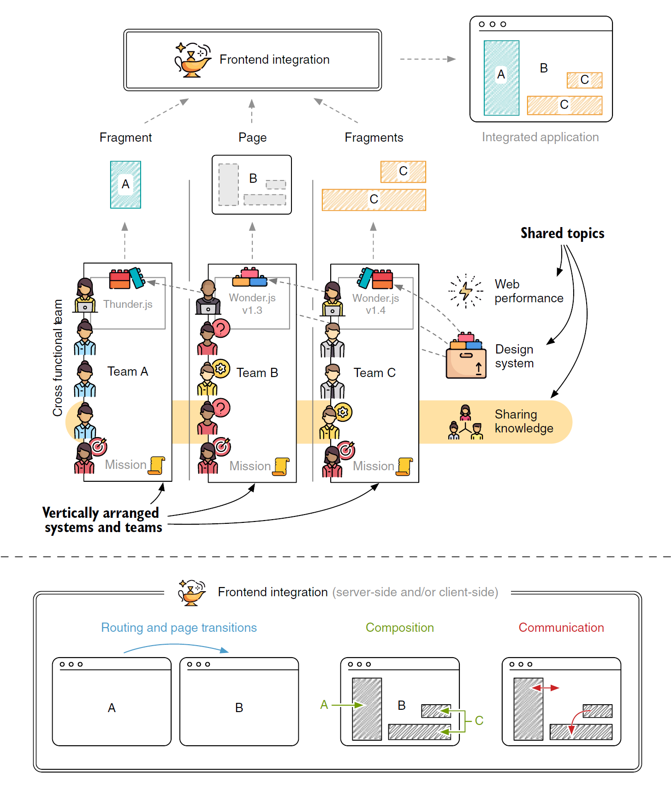
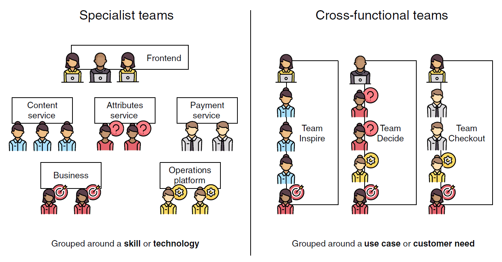
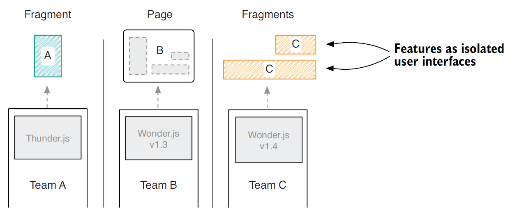
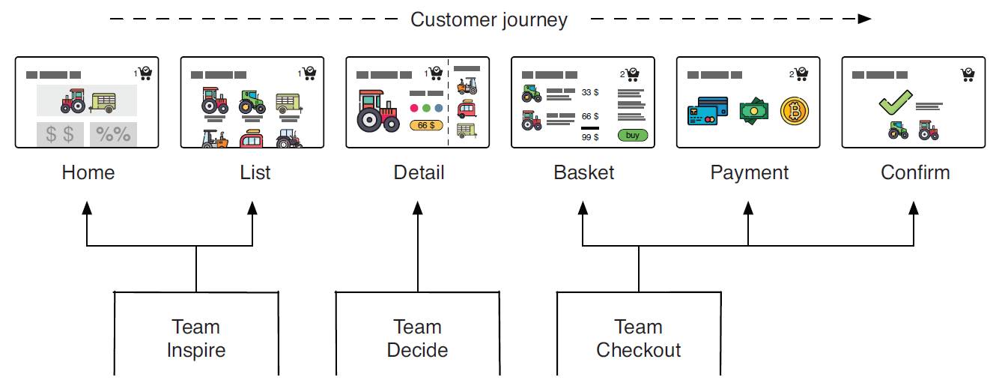
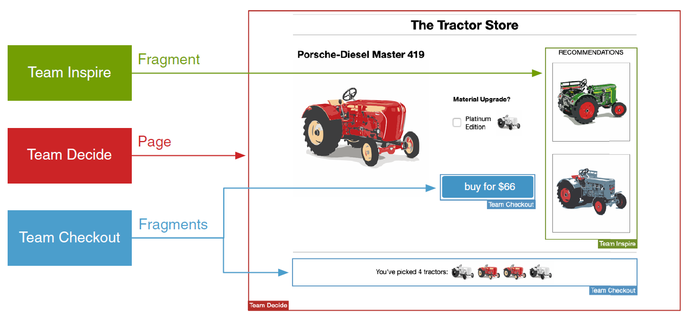
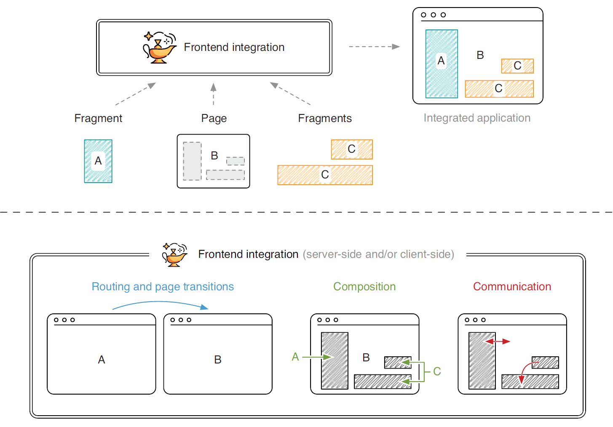
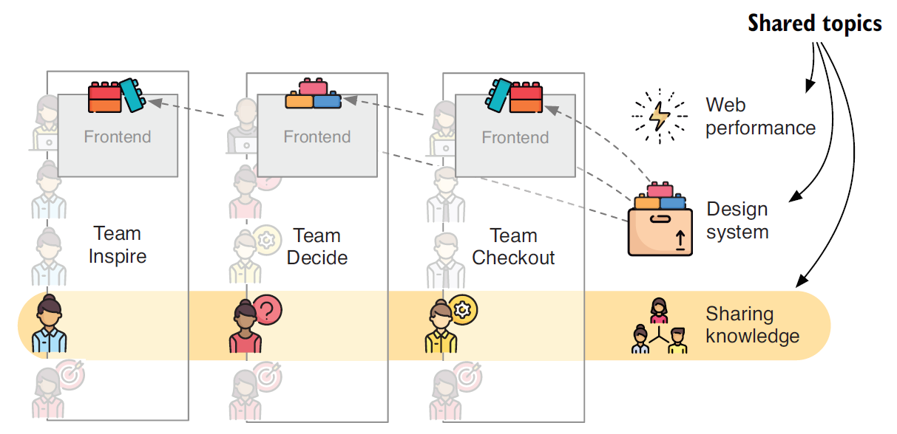

公司采用微服务架构的三个主要原因：

- **优化特性开发**：团队拥有开发特性所需的所有技能。独立的前端和后端团队之间不需要协调。
- **方便前端更新**：每个团队都拥有自己从数据库到前端的完整技术栈。团队独立地可以选择更新或者切换他们的前端技术。
- **提升客户关注**：每个团队可以直接向客户交付他们地特性，不需要纯粹地 API 团队或运维团队地存在。

## 整体概述

微前端并不是一个具体地技术，它是一种可选地组织和架构方式。

### 系统和团队

A、B、C 团队三个盒子表示的就是垂直组织的软件系统。其中每个系统都是自治的，这就意味着即使相邻系统出问题后，它也能够提供服务。要想实现这种架构，每个系统都拥有它们自己的数据仓库。另外，对于其它系统的请求并不会依赖于同步请求。每个系统由一个团队管理，每个团队负责完整的从底至上的技术栈。

#### 团队使命

每个团队掌握其自身专业并能够向客户提供他们能够创造的价值。每个团队都应该有一个描述性的名称和清晰的使命，对于团队来说，清晰的使命是非常重要的，它会阐释团队的重心并且也是软件系统划分的基础。

#### 跨职能团队

微前端和其它架构最大的区别就是团队结构的不同。下图左侧，就是典型的 **专家团队**。人员是根据技能或者技术分组的。前端开发这被分到前端组；处理支付工作的专家被分到了支付服务组；业务和运维专家同样组成了他们自己的团队。采用微服务架构时团队结构通常是这样的。

这种结构看起来并没有什么奇怪。前端开发者也喜欢一起工作，可以一起讨论 bug 的修复，技术的应用等，对于其他的团队同样也是这样。

这种假设其实并不完全合理。构建跨学科的团队越来越流行了，团队中有前后端工程师，还有运维和业务人员。由于不同的视角，这样的团队也更加具有创造力并且高效。

跨职能团队另一个好处就是所有的成员都直接参与特性的开发。在微服务模型中，服务和运维团队并不直接接触。他们从上级获取需求并且很多时候并不知道为什么这个需求很重要。而跨职能团队使得团队成员很容易全部参与进来并做贡献，最重要的是会获得 **产品的自我认同感**。

### 前端

一个微前端可以有一个完整的页面或者其他团队需要包含的片段。团队针对给定的特性生成必要的 HTML、CSS 和 JavaScript。团队之间不会共享类库和框架代码。每个团队可以灵活选择适合他们的工具或者技术，并且独立升级他们额依赖。

#### 页面所有权

每个团队都可以构建他们自己的页面，并托管于他们的应用中，并通过他们公共的域来访问。

微前端架构理解：

- 团队可以在他们的专业领域自治地工作
- 团队可以自由选择适合他们手头工作地技术栈
- 应用是松耦合地并且仅能在前端集成（比如：通过链接）

#### 片段

页面这个概念并不总是足够地。通常来说，我们会有在多个页面上出现的元素，比如页头和页尾。这时，我们不需要每一个团队重复实现它。这时候就会引入 **片段** 概念。

团队可以选择添加从其他团队提供的功能。某些片段可能需要上下文信息，也有一些片段可能引入他们自己内部分状态。但是引入片段的团队不需要知道那些片段的内部状态以及实现细节。

### 前端集成

**前端集成** 描述的是一系列可以组合各团队 UI 的工具和技术。

#### 路由和页面转换

这里讨论的是页面级集成。我们需要一个系统能够将我们从团队 A 的页面跳转到团队 B 的页面。解决方案可以简单到很直接，直接使用 **HTML 链接**。如果想要启用客户端导航，也就是在渲染下一个页面时不需要重新加载，这就会变得很复杂。实现这个，很可能会使用一个共享的 **应用 shell** 或者元框架，比如 **single-spa**。

#### 合成

获取片段的过程以及将它们放到合适的插槽中就是合成的职责。交付页面的团队通常不会直接获取片段的内容。它会在标记语言指定的地方插入标记或者占位符供片段放置。

而独立的合成服务或技术做最终的装配。我们有不同的方式来实现它。我们将解决方案分为两大类：

1. **服务端合成**，比如：SSI、ESI、Tailor 或 Podium。
2. **客户端合成**，比如：iframe、Ajax 或 Web Component。

取决于具体需求，可能选择一个或两个结合起来使用。

#### 通讯

对于交互性的应用，同样需要一个模型用于通讯。页面如何触发引入片段的更新？这个问题同样是前端集成的一部分。

### 主题共享

#### WEB 性能

因为页面是从多个团队创建的片段上组装起来的，这就会导致用户必须下载更多的代码。那么一开始对页面的性能有所关注并不是坏事。我们需要学习有用的维度和技术来优化资源的交付。同样，为了避免框架多余的下载也不要向团队自治妥协。

#### 设计系统

为了确保给用户带来一致的外观体验，那么建立一个公用的设计系统是非常明智的。可以将设计系统比作乐高的积木盒子，可以在里面随意拿取拼装。但是除了塑料块以外，Web 设计系统还包括类似于按钮，输入框，字体，图标等元素。

#### 共享知识

自治只是基础，信息不能独立。如果每个团队独立构建了错误的日志机制就会影响生产效率。采取一个共享的解决方案或者至少采取其他团队的工作会帮助我们专注于各自团队的使命任务。因此需要创建一个空间供团队之间定期信息交换。
